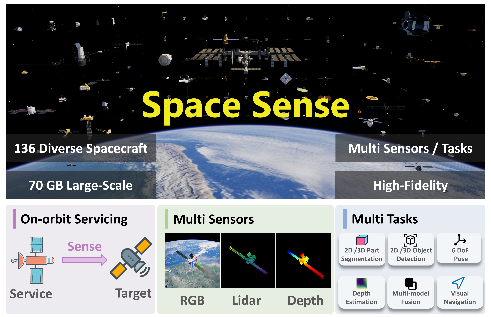

# SpaceSense-Bench

Official project page repository for the paper **"SpaceSense-Bench: A Large-Scale Multi-Modal Benchmark for Spacecraft Perception and Pose Estimation"**.

<p align="center">
  <a href="https://arxiv.org/abs/TODO">&nbsp;<b>Paper</b></a>
  &nbsp;&nbsp;|&nbsp;&nbsp;
  <a href="https://github.com/wuaodi/SpaceSense-Bench">&nbsp;<b>Webpage</b></a>
  &nbsp;&nbsp;|&nbsp;&nbsp;
  <a href="https://huggingface.co/datasets/Alvin16/SpaceSense-Bench">&nbsp;<b>Dataset</b></a>
</p>


## Overview

SpaceSense-Bench is a large-scale multi-modal（RGB, Depth, LiDAR） benchmark designed for spacecraft perception and pose estimation in autonomous space operations such as on-orbit servicing and active debris removal.

<p align="center">
  
</p>

The dataset contains 136 satellite models, each with approximately 70 GB of data. Each frame provides time-synchronized 1024×1024 RGB images, millimeter-precision depth maps, and 256-beam LiDAR point clouds, together with dense 7-class part-level semantic labels at both the pixel and point level as well as accurate 6-DoF pose ground truth.

The dataset is generated through a high-fidelity space simulation built in Unreal Engine 5 and a fully automated pipeline covering data acquisition, multi-stage quality control, and conversion to mainstream formats.


## Dataset

The full dataset is publicly available on HuggingFace:

**[https://huggingface.co/datasets/Alvin16/SpaceSense-Bench](https://huggingface.co/datasets/Alvin16/SpaceSense-Bench)**

Each satellite is packaged as a `.tar.gz` archive. Download and extract to use with the conversion tools below.

## SpaceSense-Toolkit

The [SpaceSense-Toolkit](SpaceSense-Toolkit/) directory provides tools for converting raw data to standard formats and visualizing the results.

**Supported output formats:**
- [Semantic-KITTI](http://www.semantic-kitti.org/) – 3D point cloud segmentation
- [YOLO](https://docs.ultralytics.com/) – 2D object detection
- [MMSegmentation](https://github.com/open-mmlab/mmsegmentation) – 2D semantic segmentation

**Quick start:**

```bash
pip install -r requirements.txt

# visualize the raw data
python SpaceSense-Toolkit/visualize/raw_data_web_visualizer.py --raw-data data_example

# Convert to Semantic-KITTI
python SpaceSense-Toolkit/convert/airsim_to_semantickitti.py --raw-data data_example --output output/semantickitti --satellite-json SpaceSense-Toolkit/configs/satellite_descriptions.json

# Convert to MMSegmentation
python SpaceSense-Toolkit/convert/airsim_to_mmseg.py --raw-data data_example --output output/mmseg

# Convert to YOLO
python SpaceSense-Toolkit/convert/airsim_to_yolo.py --raw-data data_example --output output/yolo

# Visualize the converted Semantic-KITTI data
python SpaceSense-Toolkit/visualize/semantickitti_web_visualizer.py --data-root output/semantickitti

# Visualize the converted YOLO data
python SpaceSense-Toolkit/visualize/yolo_web_visualizer.py --data-root output/yolo

# trajectory visualization
# double click the `trajectory.json` file to open the trajectory visualization in the browser
```


## Citation

If you find this project useful, please consider citing:

```bibtex
@article{SpaceSense-Bench,
	title={SpaceSense-Bench: A Large-Scale Multi-Modal Benchmark for Spacecraft Perception and Pose Estimation},
	author={Aodi Wu, Jianhong Zuo, Zeyuan Zhao, Xubo Luo, Ruisuo Wang, Xue Wan},
	year={2026},
	url={https://github.com/wuaodi/SpaceSense-Bench}
}
```

## Acknowledgement

This website is based on the [Academic Project Page Template](https://github.com/eliahuhorwitz/Academic-project-page-template).
